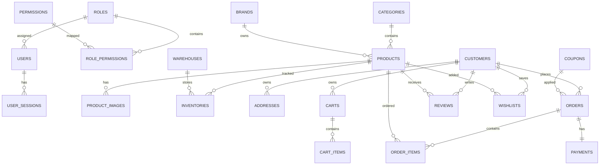

# Enterprise E-commerce Backend

An enterprise-grade E-commerce Backend built using:

- NestJS
- PostgreSQL
- Prisma ORM
- Redis
- Docker
- JWT Authentication
- RBAC Permission System

Architecture Style:

```txt
Modular Monolith
```

---

# 1. Project Goals

The system should support:

- Multi Vendor Ready
- Inventory Management
- Product Management
- Customer Management
- Shopping Cart
- Orders
- Payments
- Shipping
- Coupons
- Reviews
- Wishlist
- Notifications
- Analytics

---

# 2. Technology Stack

## Backend

- NestJS
- TypeScript

## Database

- PostgreSQL

## ORM

- Prisma

## Cache

- Redis

## Authentication

- JWT
- Refresh Token

## File Storage

- Local Storage (Development)
- AWS S3 (Production)

## Deployment

- Docker
- Docker Compose

---

# 3. Architecture

```txt
src
│
├── modules
│
├── common
│
├── config
│
├── prisma
│
├── shared
│
├── jobs
│
├── events
│
│
└── main.ts
```

---

# 4. Module Architecture

```txt
src/modules

auth
users
roles
permissions

categories
brands
products
product-images

inventory
warehouses

customers
addresses

cart
wishlist

orders
payments

reviews

coupons

shipping

notifications

analytics
```

---

# 5. Enterprise Folder Structure

```txt
src

├── modules

│   ├── auth
│   ├── users
│   ├── roles
│   ├── permissions

│   ├── categories
│   ├── brands
│   ├── products
│   ├── product-images

│   ├── inventory
│   ├── warehouses

│   ├── customers
│   ├── addresses

│   ├── cart
│   ├── wishlist

│   ├── orders
│   ├── payments

│   ├── coupons
│   ├── reviews

│   ├── shipping

│   ├── notifications

│   └── analytics

├── prisma
├── common
├── shared
├── config
└── main.ts
```

---

# 6. Database ER Diagram



---

# 7. Core Tables

## Users

```txt
id
name
email
password
phone

roleId

isActive

createdAt
updatedAt
```

---

## Roles

```txt
id
name
slug
```

---

## Permissions

```txt
id
module
action
slug
```

---

## Products

```txt
id

categoryId
brandId

name
slug
sku

shortDescription
description

price
salePrice

stock

weight

status

createdAt
updatedAt
```

---

## Inventory

```txt
id

productId
warehouseId

quantity

reservedQuantity

availableQuantity
```

---

## Customers

```txt
id

name
email
phone

password

isVerified
```

---

## Orders

```txt
id

customerId

orderNumber

subtotal
discount
shippingCost

tax

total

status

paymentStatus
```

---

## Payments

```txt
id

orderId

amount

gateway

transactionId

status
```

---

# 8. Authentication System

Authentication Features:

- Register
- Login
- Logout
- Refresh Token
- Forgot Password
- Reset Password
- Email Verification

JWT Strategy:

```txt
Access Token

15 Minutes
```

```txt
Refresh Token

30 Days
```

---

# 9. RBAC System

Roles:

```txt
Super Admin
Admin
Manager
Staff
Customer
```

Permissions:

```txt
product:create
product:update
product:delete

order:view

inventory:update
```

---

# 10. Product Module

Features:

- Create Product
- Update Product
- Delete Product
- Product Variants
- Product Images
- Product Search
- Product Filters
- Product SEO

---

# 11. Inventory Module

Features:

- Stock In
- Stock Out
- Stock Adjustment
- Inventory Logs
- Warehouse Management

---

# 12. Cart Module

Features:

- Add To Cart
- Remove From Cart
- Update Quantity
- Guest Cart
- Persistent Cart

---

# 13. Order Module

Features:

- Create Order
- Cancel Order
- Return Order
- Refund Order
- Order Tracking

---

# 14. Payment Module

Supported Gateways:

- Stripe
- SSLCommerz
- bKash
- Nagad

Payment Status:

```txt
Pending
Paid
Failed
Refunded
```

---

# 15. Shipping Module

Features:

- Shipping Zones
- Shipping Methods
- Delivery Charges
- Courier Integration

---

# 16. Coupon Module

Features:

- Percentage Discount
- Fixed Discount
- Usage Limits
- Expiration Date

---

# 17. Review Module

Features:

- Product Ratings
- Product Reviews
- Review Moderation

---

# 18. Wishlist Module

Features:

- Add Wishlist
- Remove Wishlist
- Move To Cart

---

# 19. Notification Module

Channels:

- Email
- SMS
- Push Notification

Events:

```txt
Order Created
Payment Success
Shipment Created
Order Delivered
```

---

# 20. Prisma Setup

```bash
pnpm add prisma @prisma/client

pnpm prisma init
```

Generate Prisma Client:

```bash
pnpm prisma generate
```

Run Migration:

```bash
pnpm prisma migrate dev
```

---

# 21. Docker Setup

Create:

```txt
docker-compose.yml
```

Services:

- app
- postgres
- redis

Start:

```bash
docker compose up -d
```

---

# 22. Environment Variables

```env
PORT=5000

DATABASE_URL=

JWT_SECRET=
JWT_REFRESH_SECRET=

REDIS_URL=

AWS_ACCESS_KEY=
AWS_SECRET_KEY=
AWS_BUCKET=
```

---

# 23. Installation

Clone Project

```bash
git clone repository
```

Install Packages

```bash
pnpm install
```

Generate Prisma

```bash
pnpm prisma generate
```

Run Migration

```bash
pnpm prisma migrate dev
```

Start Development

```bash
pnpm start:dev
```

---

# 24. Future Enterprise Scaling

Later Add:

- Elasticsearch
- Redis Cache
- Queue System
- Event Driven Architecture
- AWS S3
- CDN
- Multi Vendor
- Multi Tenant
- Microservices

---

# 25. Development Order

Phase 1

- Auth
- Users
- Roles
- Permissions

Phase 2

- Categories
- Brands
- Products

Phase 3

- Inventory
- Warehouses

Phase 4

- Customers
- Addresses

Phase 5

- Cart
- Wishlist

Phase 6

- Orders
- Payments

Phase 7

- Coupons
- Reviews

Phase 8

- Notifications

Phase 9

- Docker
- Redis
- Deployment

---

# END